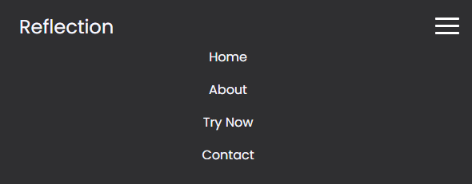
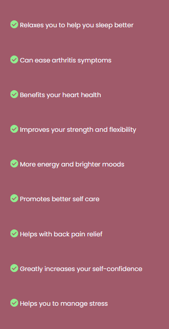
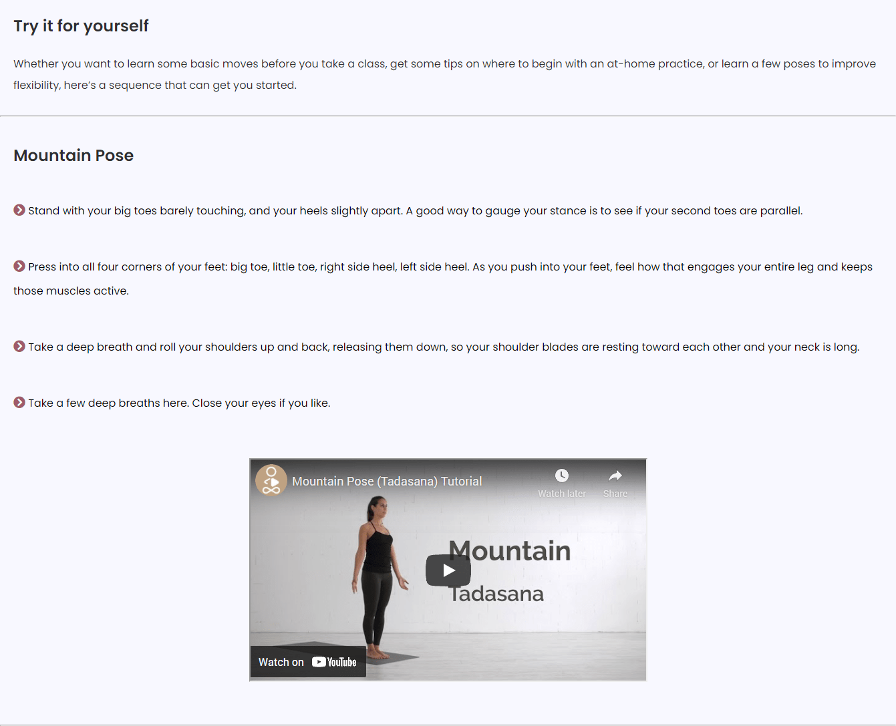
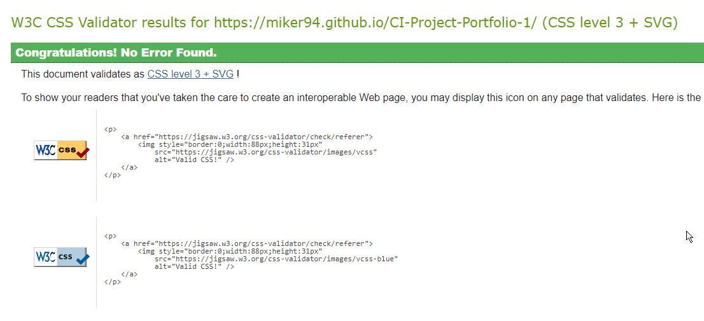
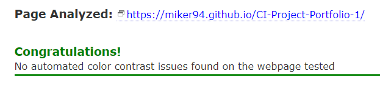
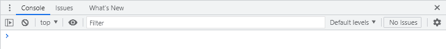

# **_Reflection_**

# Live Site

<a href="https://miker94.github.io/CI-Project-Milestone-1/index.html" target="_blank" rel="noopener">Reflection</a>

# Repository

[https://github.com/MikeR94/CI-Project-Milestone-1](https://github.com/MikeR94/CI-Project-Milestone-1)

# Contents

* [**Objective**](<#objective>)
* [**Brief**](<#brief>)
* [**User Experience UX**](<#user-experience-ux>)
    * [Design Protoype](<#design-prototype>)
    * [Site Structure](<#site-structure>)
    * [Design Choices](<#design-choices>)
    *  [Typography](<#typography>)
    *  [Colour Scheme](<#colour-scheme>)
* [**Features**](<#features>)
    * [**Home**](<#navigation-menu>)
         * [Navigation Menu](<#navigation-menu>)
         * [Home](<#home>)
         * [About](<#about>)
         * [Try It](<#try-it>)
         * [Contact](<#contact>)
         * [Footer](<#footer>)
    * [**Future Features**](<#future-features>)
         * [Testimonials](<#testimonials>)
         * [Log In](<#log-in>)
         * [Latest News](<#latest-news>)
         * [Newsletter](<#latest-news>)
* [**Technologies Used**](<#technologies-used>)
* [**Testing**](<#testing>)
* [**Deployment**](<#deployment>)
* [**Credits**](<#credits>)
    * [**Content**](<#content>)
    * [**Media**](<#media>)
*  [**Acknowledgements**](<#acknowledgements>)

# Objective

In my first project I intend to provide a professionally developed website for users to find out about Yoga. The main objective is to demonstrate competency in HTML and CSS alongside showcasing attention to detail and the importance of thorough testing.

[Back to top](<#contents>)

# Brief

Reflection is a small independant company that advertises and encourages new users to step into the wonderful world of Yoga. This site is target at individuals who have not yet tried Yoga and are looking for some help, guidance and inspiration to give it a go. Reflection is a brilliant source for people around the world to find out information about Yoga with the ability to get in touch and seek for further guidance on how to get started.

[Back to top](<#contents>)

# User Experience (UX)

## Design Prototype

The design prototype for Reflection was produced in [Figma](https://www.figma.com/). There are design prototypes for Desktop, Mobile and Laptop. The final site varies slightly from the design prototype due to developments that occured during the creation process and also from gaining valuable feedback from others.  

[Back to top](<#contents>)

## Site Structure

The website Reflection is a one page website that has 4 navigation links for the user to use. The [Home Page](index.html) is the default loading page and the subsequent sections of the home page are **About**, **Try Now** and **Contact**. The pages are all accessible primarily from the navigation menu however the user simply has to scroll down the website and they will visit these sections in the order above.

[Back to top](<#contents>)
## Design Choices

 * ### Typography
      The fonts chosen were 'Poppins' for the headings and for the body text however different font-weights and font-sizes were used to give further clarity. They fall back to sans-serif respectively if the Poppins font can't be loaded. 
     *  'Poppins' was chosen for the primarily to give the user an inital welcoming feel. The font-style is very modern and clean and gives a professional and inviting feeling to the website.

 * ### Colour Scheme
      The colour scheme eventually chosen is one based on a darker pink, lighter-black and off-white. This colour scheme gives off a warm, positive and clean feeling to the website and this is something that Reflection can hopefully pass onto the user.  

[Back to top](<#contents>)
# Features

The Reflection website is set up to be welcoming and easy to use. It contains many features that the user would probably be familiar with, such as a navigation bar and contact form. The overall feel of the website is intended to be inviting and not intimidating to encourage the user to explore further. 

## Existing Features  
  * ### Navigation Menu

    * Located at the top of the website and stays on the screen at all times, it is fully responsive and contains links to all the sections of the site to enable ease of navigation in one convenient location.
    * The logo is clickable with a link back to the home page for enhanced UX.  

[Back to top](<#contents>)

  * ### Home

      * This is the first part of the website the user will see when visiting. Designed to be a warm and welcoming full page image to welcome the user and to give a clean and clear direction of what the website is about.
      * In the middle of the image is a catchy and appealing slogan to further clarify to the user that this website is about Yoga.
      * Beneath the slogan is a simple yet effective button that encourages the user to "Learn More". Clicking this button will scroll the user down to the About section where the user will gain further information regarding Yoga and it's benefits.  

[Back to top](<#contents>)

  * ### About
    * The About section lets the user know immediately what Yoga is, are they able partake and also provides a list of benefits from doing Yoga.
    * The Benefits section breaks up the website and entices the user to focus in on what the benefits are from partaking in Yoga. It is fully responsive and splits into 2 columns at 1028px wide and then into 1 single column at 792px wide   

[Back to top](<#contents>)

  * ### Try It

    * The Try It section provides the user with some basic beginner Yoga positions to attempt.
    * It is styled so that the user is presented with both a steps and a video tutorial which are side-by-side so the user can clearly identify which Yoga position they are doing.
    * The Try-It section has 3 different Yoga positions for the user to try and they are all displayed in this exact format for Desktop. As the screen width gets smaller, the position of the steps and videos will stack on top of each other to maintain a clean and positive experience for the user.  

[Back to top](<#contents>)

* ### Contact
    
    * The contact form was designed with simplicity in mind. It has 4 input fields, these being Name, Email Address, How Can We Help and Message. 
    * The contact section is fully responsive and removes the the image and the text on the right hand side when the device width can no longer accomodate them. At this point, the form will be centralised.
    * Just below the contact section is a quote from a famous Yoga practitioner. This is to give the user some inspiration and confidence to attempt Yoga for themselves. It also provides breathing space between the contact-form and the footer of the page so the colours don't look too aggressive together.  
    

[Back to top](<#contents>)
* ### Footer
    
    * Contains social media links. To enhance the UX, the links open in seperate tabs.
    * The Facebook, Twitter, Youtube and Instagram social links are there for the educational side of this project and navigate the user to the home page of each respected site. They would be changed to re-direct the user to the respective Reflection social media if this site was deployed outside of this project.  
    

[Back to top](<#contents>)

* ## Future Features 

* ### Testimonials

    * A Testimonial section to showcase positive comments about our service.
    * This would be displayed in the form of multiple 'cards' and have a quote from the user, the users name and an image of the user if they wish to provide one.

* ### Log-In

    * Allow the user to log into the website and have a profile
    * The log-in option would be located within the navigation bar and re-direct the user to a new page where they can enter details and register an account.

* ### Latest News

    * The latest news section would be displayed on the main page but only show the most recent and appropiate headlines.
    A small link with the text "read more" will then re-direct the user to the full news article. 

* ### Newsletter

    * A simple newsletter section that would allow the user to opt-in to monthly emails sent out by Reflection on the latest and best things about Yoga and the business

[Back to top](<#contents>)

# Technologies Used
* [HTML5](https://en.wikipedia.org/wiki/HTML) - Provides the content and structure for the website.
* [CSS3](https://en.wikipedia.org/wiki/CSS) - Provides the styling for the website.
* [JavaScript](https://en.wikipedia.org/wiki/JavaScript) - Provides the responsive navigation bar for the website.
* [Figma](https://www.figma.com/) - Used to create the design prototype.
* [a11y](https://color.a11y.com/Contrast/) - Used to test the contrast and accessibility.
* [Favicon](https://favicon.io/) - Used to create the favicon.
* [Compressor](https://compressor.io/) - Used to compress the images.
* [Gitpod](https://www.gitpod.io/#get-started) - Used to create and edit the website.
* [GitHub](https://github.com/) - Used to host and deploy the website.
* [GitBash](https://en.wikipedia.org/wiki/Bash_(Unix_shell)) - Terminal used to push changes to the GitHub repository.

[Back to top](<#contents>)

# Testing

* ## Code Validation

    * The Reflection website has be throughly tested. All the code has been validated via the [W3C HTML Validator](https://validator.w3.org/), the [W3C CSS Validator](https://jigsaw.w3.org/css-validator/) and the [JSHint Validator](https://jshint.com/). 3 minor errors were found on the index.html when tested on [HTML Validation](https://validator.w3.org/) but were fixed immediately and documented below.  

* ### HTML Validation Image

    

* ### CSS Validation Image

    

* ### JS Validation Image

    

* ## Lighthouse Testing 

    * Futhermore the website has been through the [Chrome Dev Tools](https://developer.chrome.com/docs/devtools/) and [Microsoft Edge Dev Tools](https://docs.microsoft.com/en-us/microsoft-edge/devtools-guide-chromium/open/?tabs=cmd-Windows) Lighthouse Testing which tests the website for the following
        * Performance - How the page performs whilst loading.
        * Accessibility - Is the site acccessible for all users and how can it be improved.
        * Best Practices - Site conforms to industry best practices.
        * SEO - Search Engine Optimisation. Is the site optimised for search engine result rankings.  

* ### Edge Desktop Lighthouse Result

    

* ### Edge Mobile Lighthouse Result

    

* ### Chrome Desktop Lighthouse Result

    

* ### Chrome Mobile Lighthouse Result

    

    * I noticed the best practices was down by 7 points when run under the [Chrome Dev Tools](https://developer.chrome.com/docs/devtools/) and it seems to be to do with Content Security Policy. If this website was to go live for users then I would address this issue immediately however since this website was built for educational purposes and I've not yet been informed about CSP, I will look into it at a later date.  

* ## Accessibility Testing
    * I also put the website through [a11y](https://color.a11y.com/Contrast/) to further test the contrast and found no issues.    

    

* ## Responsiveness Testing
    * The responsive design tests were carried out manually with [Google Chrome DevTools](https://developer.chrome.com/docs/devtools/) and [Responsive Design Checker](https://www.responsivedesignchecker.com/).  

    

* ## Compressing Images
    * All images have been compressed with [Compressor](https://compressor.io/) and I managed to save a total of 1568 KB.  

    

    

    

    

* ## Manual Testing
    * In addition to the other tests, I have conducted a manual check list for myself to carry out to make sure that everything is working as intended.

   * ### Manual Tests Conducted
      * Navigation Menu
        * Verify that clicking on logo navigates to the top of the page.
        * Verify that when clicked, all navigation links scroll smoothly to the correct section of the page.
        * Verify that all navigation links have the :hover psuedo selector and the correct colour.
        * Verify that the navigation menu transitions into the hamburger icon at 729px wide.
        * Verify that when the hamburger is clicked, the navigation menu drops down.
        * Verify that the navigation bar stays at the top of the page at all times whilst the user scrolls.
        * Verify that the navigation bar is fully responsive.
      * Home/Landing Section
        * Verify that the hero image fits and does not pixelate.
        * Verify that the main text and Learn More button is central to the page.
        * Verify that when clicked, the Learn More button takes the user to the About section.
        * Verify that the Learn More button has the :hover psuedo selector and the correct colour.
        * Verify that the Home/Landing section is fully responsive.
      * About Section
        * Verify that the text is clearly presented with the correct font-style and font-size.
        * Verify that the text does not have any spelling mistakes.
        * Verify that the text centralises at 500px wide.
        * Verify that the About section is fully responsive.
      * Benefits Section
        * Verify that the section has the correct colour background applied.
        * Verify that the list does not have any spelling mistakes.
        * Verify that the list is clearly presented with the correct font-style and font-size.
        * Verify that the list has green tick icons and are positioned correctly.
        * Verify that the list splits into 2 columns at 1028px wide and then 1 column at 792px wide.
        * Verify that Benefits section is fully responsive.
      * Try It Section
        * Verify that the text is clearly presented with the correct font-style and font-size.
        * Verify that the text does not have any spelling mistakes.
        * Verify that the steps arrow icons and are coloured correctly.
        * Verify that all the videos do not automatically play.
        * Verify that all the videos play when the user clicks on the video.
        * Verify that the Try It section is fully responsive.
      * Contact Section
        * Verify that all elements that are set to required are working.
        * Verify that valid email address is needed with relevant '@' included.
        * Verify that the text is clearly presented with the correct font-style and font-size.
        * Verify that the text does not have any spelling mistakes.
        * Verify that 'Submit' button informs the user that the submission was successful.
        * Verify that the Contact section is fully responsive.
      * Quote Section
        * Verify that the text is clearly presented with the correct font-style and font-size.
        * Verify that the text does not have any spelling mistakes. 
        * Verify that the profile image is aligned correctly.
        * Verify that the profile image is not pixelated.
        * Verify that the Quote Section is fully responsive.
      * Footer Section
        * Verify that the social media links open in a new tab.
        * Verify that the Footer section is fully responsive
          

* ## Browser Compatibility
    * The website has been manually tested on the the following browsers and was presented with no issues.
        * Google Chrome
        * Microsoft Edge
        * Safari
          

* ## Bugs Fixed 

    ### Console Error
        
    * A console error appeared when inspecting the website with [Google Chrome DevTools](https://developer.chrome.com/docs/devtools/) and stated "Failed to load resource: the server responded with a status of 404 () /favicon.ico:1. After doing some research into this error, I found that this was simply due to the website not having a favicon.  

    

     * After implementing the favicon, the console error had disappeared  

    

    ### HTML Validation
    
    * After putting the website through [HTML Validation](https://validator.w3.org/), I was presented with the following errors  

    

    * It said that the frameborder attribute on the iframe element ID is obsolete so after removing the frameborder attribute in the HTML code, it returned with no errors  

    
    
    ### Form 404
    
    * When testing the form, I noticed that when the users click the submit button it will re-direct them to another page and display the below error   

    

    * This was caused by the form action not being set up correctly. To fix this, I changed the form action to re-direct the user to the home page and then display a browser alert to let the user know that the form submission was successful. I included some additional text to let the user know that the information they submitted was not being used and that this was for educational purposes only.  

    

* ## Bugs Unresolved  
    * When inspecting the website with [Google Chrome DevTools](https://developer.chrome.com/docs/devtools/) and selecting issues and then include third-party cookie issues, the website is showing to have 2 seperate issues.  

    
    
    * As for the cookie issue and what is causing this, I found some very good information on [StackOverflow](https://stackoverflow.com/questions/60822936/where-to-add-samesite-none). It seems to be a server side issue and there is nothing that I can do from the client side to properly recitify the issue. There is one way to to mitigate this issue but it is not a proper solution and that is to disable Cookie Deprecation through chrome://flags.

    * As for the navigator issue, I have narrowed this down to the Youtube videos that I have embedded on the site. I've done some research and apparently this is a Google Chrome issue as per this [source](https://forum.codewithmosh.com/t/the-ultimate-javascript-console-issue-at-beginning-of-course/6535) and has been reported [here](https://githubmemory.com/repo/zalmoxisus/redux-devtools-extension/issues/808). Additionally I have tested this website with Microsoft Edge and the issue doesn't show.

[Back to top](<#contents>)

# Deployment

### **To deploy the project**
The site was deployed to GitHub pages. The steps to deploy a site are as follows:
  1. In the GitHub repository, navigate to the **Settings** tab.
  2. Once in Settings, navigate to the **Pages** tab on the left hand side.
  3. Under **Source**, select the branch to **master**, then click **save**.
  4. Once the master branch has been selected, the page will be automatically refreshed with a detailed ribbon display to indicate the successful deployment.

  The live link to the Github repository can be found here - https://github.com/MikeR94/CI-Project-Milestone-1

### **To fork the repository on GitHub**
A copy of the GitHub Repository can be made by forking the GitHub account. This copy can be viewed and changes can be made to the copy without affecting the original repository. Take the following steps to fork the repository;
1. Log in to **GitHub** and locate the [repository](https://github.com/MikeR94/CI-Project-Milestone-1).
2. On the right hand side of the page inline with the repository name is a button called **'Fork'**, click on the button to create a copy of the original repository in your GitHub Account.

### **To create a local clone of this project**
The method from cloning a project from GitHub is below:

1. Under the repository’s name, click on the **code** tab.
2. In the **Clone with HTTPS** section, click on the clipboard icon to copy the given URL.
3. In your IDE of choice, open **Git Bash**.
4. Change the current working directory to the location where you want the cloned directory to be made.
5. Type **git clone**, and then paste the URL copied from GitHub.
6. Press **enter** and the local clone will be created.

[Back to top](<#contents>)

# Credits
### Content

* The font came from [Google Fonts](https://fonts.google.com/)
* The colour palette was displayed by [Coolors](https://coolors.co/)
* The icons came from [Font Awesome](https://fontawesome.com/)
* The responsive preview image at the top of the README.md came from  [Techsini](https://techsini.com/multi-mockup/index.php)
* The responsive Youtube video came from a [YouTube Tutorial](https://www.youtube.com/watch?v=0L8cQ9nRtuE&t=671s)
* The JavaScript code for the responsive navigation bar was provided and taught to me by brother [Jack Ralph](https://github.com/jackralph)
* The text content came from [NHS](https://www.nhs.uk/live-well/exercise/guide-to-yoga/) and [HealthLine](https://www.healthline.com/health/fitness-exercise/beginner-yoga-poses)
* The favicon came from [Favicon](https://favicon.io/) 

### Media
* The images came from [Pexels](https://www.pexels.com/), [HiClipArt](https://www.hiclipart.com/) and [YogaJournal](https://www.yogajournal.com/)
* The photos were compressed using [Compressor](https://compressor.io/)

[Back to top](<#contents>)

# Acknowledgements
The site was completed as a part of a Full Stack Software Developer Diploma at the [Code Institute](https://codeinstitute.net/) and is my Portfolio Project Milestone 1. I would like to thank my mentor [Precious Ijege](https://www.linkedin.com/in/precious-ijege-908a00168/), my educator [Luke Walters](https://www.linkedin.com/in/luke-walters-leatherbarrow-531107101/), and my brother [Jack Ralph](https://www.linkedin.com/in/jackthomasralph/), the Slack community, and all at the Code Institute for their help and support. Building Reflection taught me so much and now I feel so much more confident when it comes to designing, building, testing and deploying a fully functioning website.

Mike Ralph 2021.

[Back to top](<#contents>)